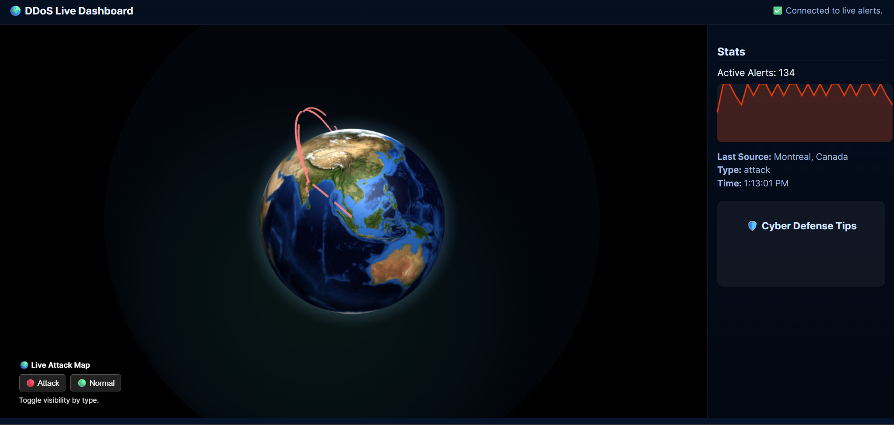

# 🌐 Live Cyberattack Detection & Visualization Dashboard

[](https://python.org)
[](LICENSE)
[](https://docker.com)

A real-time cybersecurity dashboard that visualizes network attacks on a 3D globe, combining **ML-based DDoS detection** with **Cowrie honeypot integration** for SSH brute-force attack monitoring.

## 

---

## 📋 Table of Contents

- [Overview](#-overview)
- [Architecture](#-architecture)
- [Features](#-features)
- [Prerequisites](#-prerequisites)
- [Quick Start](#-quick-start)
- [Project Structure](#-project-structure)
- [Configuration](#-configuration)
- [Usage Guide](#-usage-guide)
- [Components](#-components)
- [Troubleshooting](#-troubleshooting)
- [Project Validation](#-project-validation)
- [License](#-license)

---

### 🎯 Objectives

- Visualize real-time or simulated cyberattacks in a **3D world map**.
- Show **source and target countries** dynamically connected by animated arcs.
- Provide a **live statistics sidebar** with top sources, logs, and prevention tips.
- Deliver a **smooth, modern, and responsive UI** optimized for performance.
- Serve as a base for integrating **real threat intelligence feeds** in the future.

---

## 🛠️ Tech Stack Used

| Layer / Component                 | Technologies Used                                              | Description                                                                                                 |
| --------------------------------- | -------------------------------------------------------------- | ----------------------------------------------------------------------------------------------------------- |
| **Model Development & Training**  | **Python**, NumPy, Pandas, Scikit-Learn / TensorFlow / PyTorch | Used to define, train, and evaluate the machine-learning model for detecting cyberattacks (including DDoS). |
| **Backend / API Server**          | **Flask (Python)**                                             | Serves the trained model, exposes prediction APIs, handles requests from the dashboard.                     |
| **Frontend (Dashboard UI)**       | **HTML**, **CSS**, **JavaScript**                              | Builds the main user interface dashboard for visualizing predictions, logs, alerts, and attack insights.    |
| **3D Visualization**              | **Three.js (3JS)**                                             | Used for rendering the interactive 3D globe on the dashboard to visualize incoming attack traffic.          |
| **Data Handling & Visualization** | Chart.js / D3.js                                               | Used for graphs, charts, or additional visual analytics.                                                    |

---

## 📊 Evaluation Metrics

The model was tested on a dataset of network traffic to measure its performance in detecting attacks.

| Metric    | Value |
| --------- | ----- |
| Accuracy  | 71%   |
| Precision | 67%   |
| Recall    | 67%   |
| F1-Score  | 67%   |

---

## 🎛️ Dashboard Preview

The dashboard provides a real-time visualization of network attacks:

- **3D Globe**: Displays attack sources and intensity using Three.js.
- **Attack Logs**: Real-time table of detected cyberattacks.
- **Graphs & Charts**: Visual representation of attacks over time and types.
- **Alerts**: Immediate notifications for high-risk events.



---

## 🚀 How to Run the Project

Follow these steps to start the system:

1. **Clone the repository:**

```
git clone https://github.com/Arijit2175/Live-DDOS-Detector.git
cd Live-DDOS-Detector
```

2. **Start the server:**

- Open a terminal and run:

```
python server.py
```

> ⚠️ The detection system only works when the server is running. If the server is off, no attacks will be detected.

3. **Open the dashboard:**

- Open your web browser and navigate to:

```
http://localhost:5000
```

- The dashboard will appear.

---

## 🖥️ What Happens

### Data Flow

1. **Attack Generation** - Hydra/Paramiko (Arch) OR Real Attackers (Internet) → Ubuntu VM
2. **Honeypot Logging** - Cowrie captures attempts → `cowrie.json`
3. **Log Forwarding** - `cowrie_to_traffic.py` fetches logs via SSH → writes to `alerts.jsonl`
4. **ML Detection** - `detect_live.py` analyzes live packets → generates alerts
5. **Dashboard Streaming** - `server.py` streams alerts via SSE → frontend updates 3D globe

---

## ✨ Features

| Feature                     | Description                                            | Status |
| --------------------------- | ------------------------------------------------------ | ------ |
| 🌍 **3D Attack Map**        | Interactive globe with animated arcs between countries | ✅     |
| 🔍 **ML DDoS Detection**    | Random Forest model trained on traffic features        | ✅     |
| 🍯 **Honeypot Integration** | Cowrie SSH/Telnet honeypot for attack capture          | ✅     |
| 📊 **Real-time Dashboard**  | Live attack table, statistics, and charts              | ✅     |
| 🚨 **SSE Streaming**        | Server-Sent Events for real-time updates               | ✅     |
| 💾 **Attack Logging**       | All attacks saved to `alerts.jsonl`                    | ✅     |
| 🧪 **Attack Simulation**    | Hydra, Python scripts, and built-in traffic generators | ✅     |
| 📈 **Analytics Report**     | Export attack data for analysis                        | ✅     |

---

## 📦 Prerequisites

### Hardware Requirements

- **Arch Linux** (Host) - 4GB RAM, 2 CPU cores minimum
- **Ubuntu VM** (Target) - 2GB RAM, 20GB disk
- Network connectivity between Host and VM

### Software Requirements

#### On Arch Linux:

```bash
# Core dependencies
python 3.10+
docker (optional, for containerized deployment)
git

# Install required packages
sudo pacman -S python-pip hydra nmap openssh
pip install --user paramiko requests scapy
* **Attack Prediction Model:**
  Runs automatically when the server starts and continuously monitors network traffic.

* **Packet Transfers Visualization:**

  * Normal and unusual network packets are displayed on a 3D globe using Three.js.
  * Any unusual or suspicious packet transfers are logged and shown in the **logs** section.

* **Graphs & Analytics:**

  * Real-time graphs show network activity trends.
  * Attack types and intensities are updated dynamically on the dashboard.

---

## 📝 Project Structure

```

Live-DDOS-Detector
│
├── backend/
├── detect_live.py
├── features.py
├── server.py
├── train_model.py
├── data
├── alerts.jsonl
├── datasets
├── frontend
├── index.html
├── style.css
├── script.js
├── models
├── scripts
├── capture.py
├── traffic_gen_http.py
├── traffic_gen_udp_tcp.py
├── tools
├── append_alerts.py
├── requirements.txt
└── README.md

```

---

## 🔮 Future Scope

The project can be extended and improved in several ways:

- **Multi-Attack Detection:** Extend the system to detect multiple types of cyberattacks beyond DDoS, such as SQL injection, phishing, or malware traffic.
- **Automated Alerting:** Integrate email, SMS, or push notifications to alert administrators immediately when suspicious activity is detected.
- **Enhanced Analytics:** Add more detailed dashboards with filterable logs, attack trends, and statistical insights for better monitoring.
- **Machine Learning Improvements:** Experiment with more advanced models, ensemble methods, or deep learning approaches to improve detection accuracy.
- **Scalability:** Deploy the system using Docker, Kubernetes, or cloud platforms to handle larger networks and higher traffic volumes.
- **Live Network Integration:** Capture and analyze traffic in real time from multiple network sources, with historical logging and replay capabilities.
- **User Management & Permissions:** Add authentication, role-based access, and user-specific dashboards for better control.
- **Mobile-Friendly Dashboard:** Make the dashboard responsive or develop a mobile app to monitor attacks on the go.
- **Automated Response:** Implement automated mitigation strategies like firewall rules or throttling for detected attacks.

---


## 📚 References

- [Flask Documentation](https://flask.palletsprojects.com/) – Official documentation for building the backend server.
- [Scikit-Learn Documentation](https://scikit-learn.org/stable/) – Used for machine learning model training and evaluation.
- [Three.js Documentation](https://threejs.org/docs/) – For 3D globe visualization on the dashboard.
- [Python Official Documentation](https://docs.python.org/3/) – Python language reference.
- Research papers and tutorials on DDoS and cyberattack detection:
  - “A Survey on DDoS Attacks and Defense Mechanisms”
  - “Machine Learning Approaches for Intrusion Detection Systems”
- [Chart.js](https://www.chartjs.org/) / [D3.js](https://d3js.org/) – For dynamic graphs and analytics on the dashboard.

<br>
```
